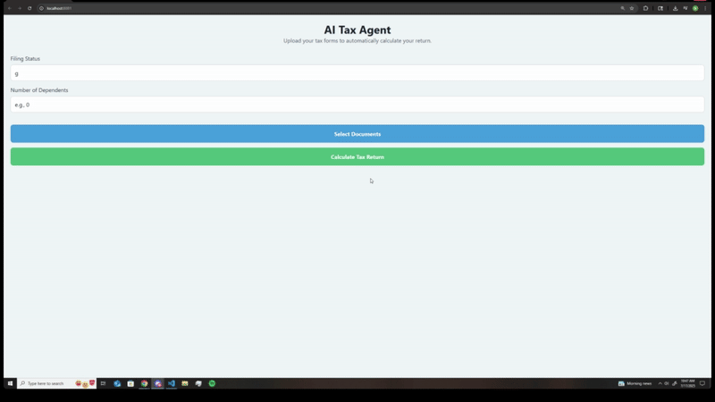
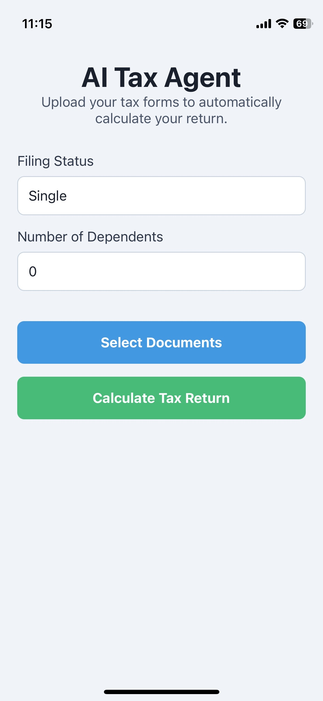

# AI Tax Return Agent Prototype

This project is a functional, end-to-end prototype of an AI agent that automates personal tax return preparation. It allows users to upload standard U.S. tax documents (W-2, 1099-NEC, 1099-INT), extracts relevant financial data using a Document AI model, calculates the user's estimated tax liability, and generates a simplified Form 1040 PDF.

## Demo



## Screenshot



## Features

* **Cross-Platform Frontend**: Built with React Native, allowing it to run on web browsers, iOS, and Android.
* **Multi-Document Upload**: Users can select and upload multiple PDF tax forms at once.
* **Intelligent Document Processing**: The Python backend uses a state-of-the-art AI model (`impira/layoutlm-document-qa`) to:
    * Automatically classify each uploaded document (W-2, 1099-NEC, etc.).
    * Extract key financial data by asking natural language questions (e.g., "What is the amount in box 1 for Wages?").
    * Intelligently filter out irrelevant instructional pages from documents.
* **Automatic Tax Calculation**: Aggregates all extracted income and withholdings and calculates the estimated tax due or refund based on 2024 IRS tax brackets and standard deductions.
* **PDF Form Generation**: Dynamically generates a simplified, DRAFT Form 1040 PDF populated with the calculated results.
* **Clean, Responsive UI**: The user interface is designed to be clear and easy to use, providing detailed feedback on the extracted data and final calculations.

## Tech Stack

| Area      | Technology                                                              | Description                                                                 |
| :-------- | :---------------------------------------------------------------------- | :-------------------------------------------------------------------------- |
| **Frontend** | **React Native** & **Expo** | For building a cross-platform user interface.                               |
| **Backend** | **Python** & **FastAPI** | For creating a fast, modern, and scalable API server.                       |
| **AI / ML** | **PyTorch** & **Hugging Face Transformers** | To run the `impira/layoutlm-document-qa` model for document understanding.  |
| **PDF Tools** | **PyMuPDF (fitz)**, **Pillow**, **ReportLab** | For reading PDF content, processing images for the AI, and generating the final Form 1040. |

## Project Setup and Installation

### Prerequisites

* Node.js and npm/yarn for the frontend.
* Python 3.8+ and `pip` for the backend.
* **Tesseract OCR Engine**: The AI model relies on OCR. Install it on your system:
    * **Windows**: Download from the [official Tesseract repository](https://github.com/UB-Mannheim/tesseract/wiki).
    * **macOS**: `brew install tesseract`
    * **Linux (Ubuntu)**: `sudo apt-get install tesseract-ocr`

### Backend Setup

1.  **Navigate to the `backend` directory:**
    ```bash
    cd /path/to/your/project/backend
    ```
2.  **Create and activate a virtual environment (recommended):**
    ```bash
    python -m venv venv
    source venv/bin/activate  # On Windows, use `venv\Scripts\activate`
    ```
3.  **Install Python dependencies:**
    ```bash
    pip install "fastapi[all]" torch transformers sentencepiece Pillow PyMuPDF reportlab python-multipart
    ```
4.  **Configure Tesseract Path (if needed):**
    * Open `main.py` and ensure the `pytesseract.pytesseract.tesseract_cmd` path is correct for your system.

### Frontend Setup

1.  **Navigate to the `frontend/TaxAgentApp` directory:**
    ```bash
    cd /path/to/your/project/frontend/TaxAgentApp
    ```
2.  **Install Node.js dependencies:**
    ```bash
    npm install
    ```

## How to Run the Application

1.  **Start the Backend Server:**
    * In your terminal, from the `backend` directory, run:
        ```bash
        uvicorn main:app --reload
        ```
    * The first time you run this, it will download the AI model from Hugging Face (approx. 1-2 GB). This is a one-time process.
    * The backend will be running at `http://localhost:8000`.
2.  **Start the Frontend Application:**
    * In a **new** terminal, from the `frontend/TaxAgentApp` directory, run:
        ```bash
        npm start
        ```
    * Expo will start the development server.
3.  **Use the App:**
    * The application is fully functional on the **web**. Open it in your browser at [AI TaxAgentApp](https://sunny-florentine-b9e9cf.netlify.app/) [](https://app.netlify.com/projects/sunny-florentine-b9e9cf/deploys).
    * Enter your filing status and number of dependents.
    * Click "Select Documents" to upload your sample PDF tax forms.
    * Click "Calculate Tax Return" to send the files to the backend for AI processing.
    * View the results and download your generated Form 1040.

### Note on iOS Mobile Testing

The application code is cross-platform, but testing the native file picker on iOS requires a **custom development build**. This is because the standard Expo Go testing app does not reliably handle the iCloud file permissions needed for document selection.

Creating a custom development build requires a paid Apple Developer Program membership ($99/year) to generate the necessary credentials. For this prototype, we have focused on the fully functional web version to demonstrate the core AI capabilities without this platform-specific overhead.

---

## Case Study Wrap-Up & Reflection

### Reflection

* **What Worked Well:**
    * **AI-Powered Data Extraction:** The decision to use the `impira/layoutlm-document-qa` model was highly successful. It proved to be far more robust and accurate than the initial regex-based approach, capable of handling different document layouts and OCR inconsistencies.
    * **FastAPI Backend:** FastAPI was an excellent choice, providing a high-performance, easy-to-use framework for the API server. Its automatic documentation features are a significant plus.
    * **Cross-Platform Foundation:** Using React Native and Expo provided a solid foundation for a cross-platform application, with the web version working flawlessly.

* **What Was Challenging:**
    * **Initial Data Extraction:** The first attempt at data extraction using only OCR and regular expressions was brittle. It failed frequently on minor variations in document formatting, which led to the crucial decision to pivot to a true AI/ML model.
    * **iOS Tooling Limitations:** The primary challenge was the limitation of the standard Expo Go app on iOS, which could not handle the file-picking permissions correctly. This highlighted the difference between a cross-platform codebase and the practicalities of mobile deployment, where platform-specific fees and build processes (like the Apple Developer Program) are a significant factor.

### Design Choices: Evolving the Data Extraction Engine

The project's most significant design choice was the evolution of its data extraction method:

1.  **Attempt 1: OCR + Regex:** The initial prototype used a simple method of extracting all text from a PDF and using regular expressions to find keywords like "Wages" and the numbers next to them. This was fast to implement but proved unreliable, as OCR errors or slight layout changes would break the patterns.

2.  **Attempt 2: AI Document Q&A (The Solution):** The system was upgraded to use a true Document AI model. Instead of searching for text, this model analyzes an *image* of the document and can answer natural language questions. The final, most accurate implementation uses a two-stage process:
    * **Stage 1 (Filtering):** A lightweight check determines if a page looks like a real tax form to avoid wasting time on instructional pages.
    * **Stage 2 (Q&A):** For valid forms, the AI is asked highly specific questions (e.g., "What is the amount in box 1?"). This combination of filtering and targeted questioning proved to be the most accurate and efficient solution.

### Future Improvements (Production Version)

To move this prototype to a production-ready application, the following features would be essential:

* **Upgrade the AI Model:** While the current LayoutLM-based model works well, accuracy could be further improved by exploring more advanced, specialized models. This could involve:
    * **Fine-tuning:** Fine-tuning a model like LayoutLMv3 or Donut on a custom dataset of tagged tax documents to achieve expert-level accuracy on specific forms.
    * **Commercial APIs:** Integrating with enterprise-grade document AI services like Google Document AI or Amazon Textract, which are pre-trained on millions of financial documents and often provide higher out-of-the-box accuracy for a fee.

* **Support for More Forms**: Extend the AI logic to handle other common forms like `1098` (Mortgage Interest), `Schedule C` (Business Income), and `1099-DIV` (Dividends).

* **Itemized Deductions**: Implement a user interface and logic to allow users to enter itemized deductions (e.g., mortgage interest, state and local taxes) and have the system choose the most beneficial option (standard vs. itemized).

* **Enhanced Security & Compliance**: For a production application handling sensitive financial data, security would be paramount. This includes:
    * Data encryption at rest and in transit.
    * Secure user authentication.
    * A robust privacy policy and compliance with financial data regulations.

* **State Tax Returns**: Add modules to calculate state tax liability based on the federal return, which is a critical feature for most users.

* **Integration with IRS API Sandbox**: For a legitimate e-filing service, the application would need to be integrated with the IRS's official systems, starting with their API sandbox for testing.

* **AI-based Anomaly Detection**: A more advanced AI could be used to flag unusual entries or potential audit risks for the user, providing real-time feedback and tips.
